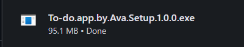
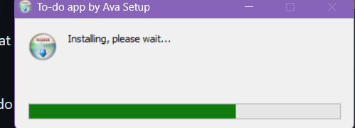
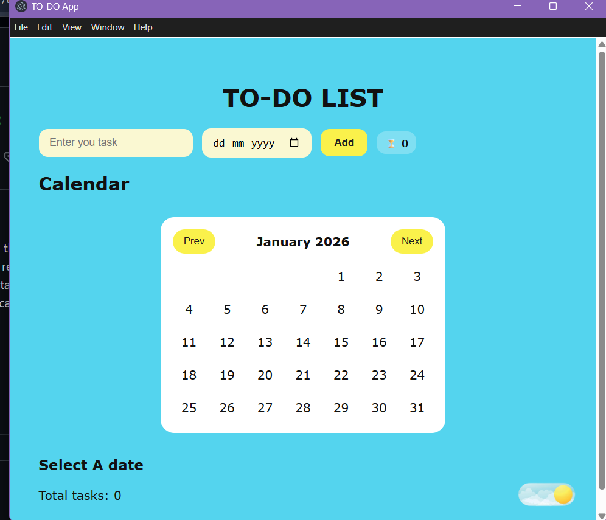

# to-do-electron

TO-DO app or task tracker

1.you can add task month-wise

2.you can directly click on the specific date so that you can add task to that date

3.a task counter to count how many tasks are remaining

4.Dark and light mode so that your eyesight stays better

5.task counter also for single day so that you can see how many tasks to do every single day.

To run This locally on your machine :

1.Simply install tthe application from the releses the ".exe" file

(if some alert appears just click on more info and the click on Run anyway it's not harmful for your device)
Then it will install automatically

Then you're good to go to use my application

demo video

